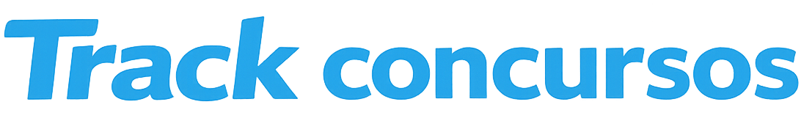
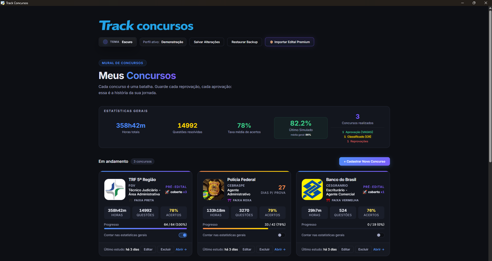

<p align="center">
  
</p>

<p align="center">
  Aplicativo desktop para organizar estudos para concursos com foco em pré e pós-edital,
  registrar sua rotina diária de estudos, revisões, simulados e análise de desempenho.
</p>

<p align="center">
  <a href="#requisitos-para-instalacao"></a>
  <a href="#instalacao"></a>
  <a href="https://www.youtube.com/watch?v=YrqFyPrqRSQ"></a>
  <a href="#visao-geral"></a>
  <a href="#licenca-de-uso"></a>
</p>

<p align="center">
  
  
</p>

<p align="center">
  
  
</p>

<p align="center">
  
</p>

**Track Concursos** é um aplicativo desktop criado para organizar a rotina de estudos para concursos públicos, desde o planejamento do pré-edital até a análise pós-prova, reunindo organização do seu material de estudo, execução e acompanhamento de desempenho em uma única experiência local e gratuita.

## Apoie o projeto

O **Track Concursos** é gratuito para uso pessoal.

Se ele foi útil para você, considere apoiar o projeto com uma doação via Pix ou adquirindo um **Edital Premium** feito por mim, já estruturado para uso dentro do aplicativo.

### Contato

- WhatsApp: [falar comigo](https://api.whatsapp.com/send?phone=5589981383459&text=Ol%C3%A1,%20estou%20interessado%20em%20um%20Edital%20Premium%20para%20o%20Track%20Concursos)
- E-mail: `michel.araujo.py@gmail.com`
- Chave Pix: `michelaraujo100@gmail.com`

QR Code Pix

<p>
  
</p>

---

## Sumário

- [Apoie o projeto](#apoie-o-projeto)
- [Visão Geral](#visao-geral)
- [Por Que Este Projeto Existe](#por-que-este-projeto-existe)
- [Principais Funcionalidades](#principais-funcionalidades)
- [Modelos de Prova Suportados](#modelos-de-prova-suportados)
- [Manual de uso inicial](#manual-de-uso-inicial)
- [Requisitos para Instalação](#requisitos-para-instalacao)
- [Instalação](#instalacao)
- [Como Abrir o Programa](#como-abrir-o-programa)
- [Estrutura do Projeto](#estrutura-do-projeto)
- [Dados e Portabilidade](#dados-e-portabilidade)
- [Licença de Uso](#licenca-de-uso)
- [Sobre o Desenvolvimento](#sobre-o-desenvolvimento)
- [Solução de Problemas](#solucao-de-problemas)

---

<h2 id="visao-geral">Visão Geral</h2>

O Track Concursos foi criado para ser o centro da sua preparação. Aqui, cada concurso vira um projeto completo de estudo, com conteúdo programático organizado, ciclo de estudos, painel da prova, revisões, simulados e métricas que ajudam você a enxergar com clareza onde está evoluindo e onde ainda precisa melhorar.

Com ele, é possível:

- cadastrar concursos em pré-edital, pós-edital ou já realizados
- organizar matérias, tópicos e subtópicos
- montar ciclo de estudos ou cronograma semanal
- registrar horas, questões, revisões e sessões de estudo
- configurar o painel da prova com quantidade de questões e pesos
- lançar simulados com cálculo automático de nota
- analisar desempenho geral e por matéria
- importar estruturas prontas via Edital Premium
- usar perfis separados no mesmo computador sem misturar dados

> [!TIP]
> Entre no grupo do Telegram para ter acesso a Editais Premium gratuitos.
> Entre em contato se quiser um em específico.

---

## Por Que Este Projeto Existe

Como concurseiro, eu sei que a nossa preparação para concursos costuma ficar espalhada entre PDFs, cronômetros, planilhas, cadernos e plataformas de questões. O Track Concursos nasceu para reunir essas camadas em um único ambiente organizado, reduzindo a fragmentação e permitindo um acompanhamento mais claro da jornada, inclusive com acesso rápido aos seus materiais de estudo.

Ele centraliza:

- planejamento do edital com apoio de inteligência artificial para organizar o conteúdo programático
- rotina diária de estudo com ciclo de estudos
- registro de horas estudadas e questões, com análise dos pontos fortes e fracos
- revisões periódicas
- simulados com uma área de análise de dados específica
- histórico de resultados, desde reprovações até aprovações e nomeações

> [!TIP]
> Com o Painel da Prova preenchido adequadamente e realizando simulados no mesmo formato do edital,
> a sua nota é calculada automaticamente. O modo CESPE/CEBRASPE também está disponível.

---

## Principais Funcionalidades

### 1. Gestão completa por concurso

Cada concurso pode armazenar:

- instituição, banca, cargo e data da prova
- status de pré-edital, pós-edital ou realizado
- matérias, tópicos e subtópicos
- progresso por cobertura de edital
- histórico de aprovação, reprovação e classificação

### 2. Ciclo de estudos e cronograma semanal

O programa suporta dois modelos de planejamento:

- **Ciclo de Estudos**: ideal para rotinas imprevisíveis, com sequência contínua de matérias e metas de tempo
- **Cronograma Semanal**: ideal para quem prefere organizar os estudos por dias fixos

### 3. Cronômetro, pomodoro e lançamentos manuais

O app permite registrar estudo por meio de:

- cronômetro inteligente
- Pomodoro clássico
- cronômetro livre
- lançamentos manuais de horas e questões

### 4. Revisões e progresso por tópico

Ao concluir um tópico, o usuário pode acompanhar:

- revisões atrasadas
- revisões do dia
- revisões futuras
- progresso geral dentro do edital

### 5. Simulados com análise aprofundada

Os simulados podem ser lançados manualmente ou calculados automaticamente a partir do Painel da Prova. A área de Simulados oferece:

- evolução da nota
- comparação com o simulado anterior
- comparação com a média geral
- raio-x por matéria
- análise dos pontos fortes e das maiores dificuldades

### 6. Edital Premium

O programa suporta importação de estruturas prontas em JSON, incluindo:

- matérias
- tópicos e subtópicos
- painel da prova
- simulados vinculados
- configurações estruturais do concurso

### 7. Perfis separados e backups locais

Mais de uma pessoa pode usar o programa no mesmo computador sem misturar:

- concursos
- estatísticas
- backups
- preferências do perfil

---

## Modelos de Prova Suportados

O Painel da Prova suporta atualmente dois formatos principais:

| Modelo | Lógica de cálculo |
|---|---|
| Tradicional por peso | questões x peso por matéria |
| CESPE / CEBRASPE | +1 por acerto, penalidade configurável por erro e 0 para questão em branco |

O painel também pode contemplar:

- conhecimentos gerais
- conhecimentos específicos
- redação

Isso permite que o cálculo dos simulados fique mais fiel ao edital cadastrado pelo usuário. Ao registrar a quantidade de questões e peso previstos no edital do concurso, o cálculo da sua nota é automaticamente mostrado após registrar um simulado feito.

---

## Manual de uso inicial

Um fluxo comum dentro do Track Concursos é:

1. Criar um novo concurso em `Meus Concursos`.
2. Cadastrar manualmente ou importar a estrutura do edital por meio de um Edital Premium.
3. Escolher entre ciclo de estudos e cronograma semanal.
4. Configurar o Painel da Prova.
5. Linkar seu material de estudo, incluindo PDFs locais ou links da internet em matérias, tópicos e subtópicos.
6. Registrar suas horas estudadas e questões feitas.
7. Criar e realizar simulados para acompanhar a evolução geral e por matéria.

---

<h2 id="requisitos-para-instalacao">Requisitos para Instalação</h2>

Para a forma recomendada de uso, você precisa de:

- Windows 10 ou Windows 11
- Microsoft Edge WebView2 Runtime

O WebView2 já vem instalado em muitos computadores. Se ele não estiver presente, o instalador ou o próprio aplicativo vão avisar e orientar o download oficial.

Para a instalação manual pelo código-fonte, você também precisa de:

- Python 3.11 ou superior

---

<h2 id="instalacao">Instalação</h2>

Este passo a passo foi pensado para quem nunca usou GitHub antes.

### Tutorial em vídeo

Veja o tutorial no youtube para fácil instalação e como usar a aplicação

<p align="center">
  <a href="https://www.youtube.com/watch?v=YrqFyPrqRSQ">
    
  </a>
</p>

<p align="center">
  <a href="https://www.youtube.com/watch?v=YrqFyPrqRSQ"><strong>Assistir tutorial de instalação no YouTube</strong></a>
</p>

> [!IMPORTANT]
> A forma recomendada de instalação agora é pelo instalador `.exe` disponível na área de Releases.

### 1. Baixar o instalador pela Release

1. Entre na página do repositório no GitHub.
2. Abra a área de `Releases`.
3. Baixe o arquivo `TrackConcursos-Setup.exe`.
4. Aguarde o download terminar.

### 2. Executar o instalador

1. Vá até a pasta `Downloads` do seu computador.
2. Dê duplo clique em `TrackConcursos-Setup.exe`.
3. Siga as etapas do assistente até concluir a instalação.
4. Abra o programa pelo atalho criado no menu Iniciar ou na Área de Trabalho.

### 3. Se o Windows mostrar aviso de segurança

Como a versão atual é distribuída sem assinatura digital paga, o Windows pode exibir mensagens como:

- `O Windows protegeu o computador`
- `Unknown publisher`

Se isso acontecer:

1. Clique em `Mais informações`.
2. Clique em `Executar assim mesmo`.

### 4. Se o WebView2 não estiver instalado

O aplicativo usa o **Microsoft Edge WebView2 Runtime** para renderizar a interface.

Se ele não estiver presente no computador:

- o instalador pode avisar
- o app também pode avisar na primeira execução

Nesse caso, instale o componente oficial da Microsoft e abra o programa novamente:

- [Microsoft Edge WebView2 Runtime](https://go.microsoft.com/fwlink/p/?LinkId=2124703)

### 5. Instalação alternativa pelo código-fonte

Se você preferir não usar o instalador, também pode rodar o projeto manualmente:

1. Baixe o projeto pelo GitHub usando `Code` > `Download ZIP`.
2. Extraia os arquivos do programa.
3. Instale o Python 3.11 ou superior, marcando `Add Python to PATH`.
4. Abra a pasta do projeto em um terminal.
5. Rode o comando abaixo:

```powershell
python -m pip install pywebview
```

6. Abra o programa com:

```powershell
pythonw "Track Concursos.pyw"
```

---

## Como Abrir o Programa

Se você instalou pela Release:

- abra o atalho `Track Concursos` criado pelo instalador

Se estiver usando a versão manual:

- dê duplo clique em `Track Concursos.pyw`

Ou, pelo terminal:

```powershell
pythonw "Track Concursos.pyw"
```

---

## Estrutura do Projeto

```text
Track Concursos/
|-- Track Concursos.pyw
|-- track_concursos_app.py
|-- requirements.txt
|-- README.md
|-- LICENSE
|-- backups/
|-- profiles/
|-- www/
|-- installer/
|-- docs/
`-- build-resources/
```

| Caminho | Função |
|---|---|
| `Track Concursos.pyw` | launcher principal |
| `track_concursos_app.py` | núcleo desktop do aplicativo |
| `www/` | interface HTML, CSS e JavaScript |
| `profiles/` | perfis locais do usuário no modo manual/portátil |
| `backups/` | backups e snapshots locais no modo manual/portátil |
| `installer/` | arquivos do instalador Windows |
| `docs/` | documentação de empacotamento e release |
| `build-resources/` | ícones e imagens usadas no build |

---

## Dados e Portabilidade

Quando o programa é instalado pelo `.exe`, os dados do usuário ficam salvos em:

```text
%LOCALAPPDATA%\Track Concursos
```

Isso inclui:

- perfis
- concursos
- backups
- configurações auxiliares
- logos e arquivos complementares

Na instalação manual, os dados continuam locais e podem ficar na própria pasta do projeto, principalmente em:

- `profiles/`
- `backups/`

Na prática:

- no modo instalado, os dados ficam separados da pasta do programa
- no modo manual/portátil, a pasta do projeto continua concentrando os dados locais

---

<h2 id="licenca-de-uso">Licença de Uso</h2>

O Track Concursos é disponibilizado gratuitamente para **uso pessoal e não comercial**.

Sem autorização prévia e por escrito do autor, não é permitido:

- modificar o software
- redistribuir versões originais ou alteradas
- vender, revender, sublicenciar ou explorar comercialmente o programa
- comercializar conteúdos premium vinculados ao projeto

Consulte [LICENSE](LICENSE) para os termos completos.

---

## Sobre o Desenvolvimento

O projeto foi idealizado por mim e desenvolvido com apoio de ferramentas de inteligência artificial.

Tecnologias utilizadas:

- Linguagens: HTML, CSS, JavaScript e Python
- Claude Sonnet 4.6: utilizado no início do projeto
- Antigravity Gemini 3 Flash e Gemini 3.1 Pro: utilizados em grande parte do desenvolvimento
- Codex GPT-5.4: utilizado em correções, melhorias e na finalização do projeto

No processo de empacotamento da versão Windows, o projeto também utiliza:

- PyInstaller
- Inno Setup

---

## Solução de Problemas

### `O Windows protegeu o computador`

Isso pode acontecer porque a versão atual ainda não possui assinatura digital paga.

Faça assim:

1. Clique em `Mais informações`.
2. Clique em `Executar assim mesmo`.

### O navegador não conclui o download do instalador

Alguns navegadores podem interromper o download por reputação baixa do arquivo. O código-fonte está aberto aqui no github e não oferece risco algum.

Alternativas:

- tentar baixar novamente e escolher manter o arquivo, quando essa opção aparecer
- Ir nos seus downloads procurar o arquivo e renomear para Track Concursos.exe e executá-lo


### O app avisou que falta WebView2

Instale o componente oficial da Microsoft:

- [Baixar WebView2 Runtime](https://go.microsoft.com/fwlink/p/?LinkId=2124703)

Depois abra o programa novamente.

### `python` não é reconhecido como comando

- reinstale o Python marcando `Add Python to PATH`

### `No module named webview`

Rode:

```powershell
python -m pip install pywebview
```

### `A janela abre em branco`

Verifique se:

- o WebView2 Runtime está instalado
- a pasta `www/` está na mesma pasta do programa, no modo manual

### `O launcher .pyw não abriu`

Tente:

```powershell
pythonw "Track Concursos.pyw"
```

---

## Contato e comunidade

Sugestões, feedbacks, avisos de bugs e dúvidas são sempre bem-vindos. Também estou disponível para tirar dúvidas e auxiliar no uso do programa no grupo do Telegram.

- [Grupo no Telegram](https://t.me/+nlYaAYBFTYs4YTYx)

Você também pode falar comigo diretamente por:

- WhatsApp: [falar comigo](https://api.whatsapp.com/send?phone=5589981383459&text=Ol%C3%A1,%20estou%20interessado%20em%20um%20Edital%20Premium%20para%20o%20Track%20Concursos)
- E-mail: `michel.araujo.py@gmail.com`

---

Para uso normal, abra sempre o atalho instalado do `Track Concursos` ou, no modo manual, `Track Concursos.pyw`.
